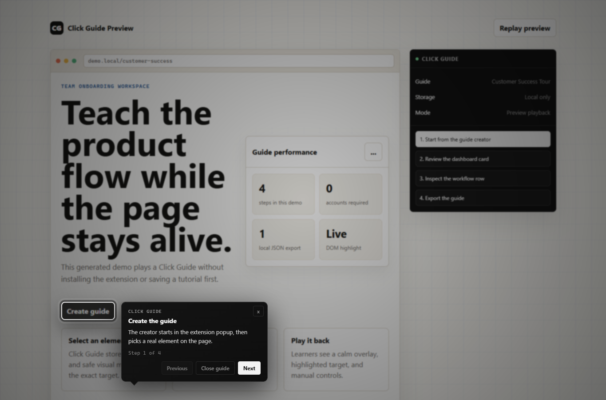

# Click Guide

Click Guide is a lightweight Chrome extension for creating interactive, step-by-step tutorials directly on top of real websites.

It helps an experienced colleague turn a web workflow into a calm visual guide: each step highlights the exact DOM element to look at and shows an instruction popup nearby.

## MVP

- Create local guides from the current tab.
- Add steps by manually selecting DOM elements.
- Write each step title and instruction yourself.
- Play guides with highlight, dimming, autoscroll, Previous, Next, Continue anyway, Finish, and Close.
- Export guides as readable `.clickguide` JSON files.
- Import `.clickguide` files by drag-and-drop and start playback immediately.

## Install

1. Open `chrome://extensions`.
2. Enable Developer mode.
3. Click Load unpacked.
4. Select this repository folder.
5. Pin Click Guide in the toolbar.

No backend, account, or build step is required.

## Quick Preview

Open `smoke/preview.html` to show an auto-playing Click Guide demo without installing the extension or creating a saved tutorial.

If the browser blocks local scripts, serve the repo locally and open `http://127.0.0.1:<port>/smoke/preview.html`.

## Create And Play A Guide

1. Open a website or local smoke page.
2. Click Click Guide.
3. Click Create guide.
4. Click Add step.
5. Select an element on the page.
6. Confirm the in-page message appears.
7. Reopen Click Guide.
8. Write the step title and body.
9. Save the step.
10. Add more steps or click Play.

During playback, the learner can always go Previous, Continue/Next/Finish, or Close.

## Export And Import

- Export downloads readable JSON with the `.clickguide` extension.
- Import accepts `.clickguide` or `.json` files by drag-and-drop.
- Imported guides are validated before saving.
- Duplicate guide IDs are replaced so existing guides are not corrupted.
- Import starts playback immediately and navigates to the guide start URL when needed.

## Manual Smoke Test

Use `smoke/index.html` for manual coverage. If Chrome blocks file URLs for the unpacked extension, serve the repo locally and open `http://127.0.0.1:<port>/smoke/index.html`.

1. Load the extension unpacked.
2. Open `smoke/index.html`.
3. Create a guide.
4. Add steps for: normal button, text inside button, SVG icon button, label next to input, input itself, select, textarea, non-interactive visual card, and the below-fold section.
5. Play the guide.
6. Verify highlight, popup placement, autoscroll, Previous, Next, Finish, Close, and Escape.
7. Export a `.clickguide` file.
8. Import it by drag-and-drop.
9. Verify playback starts directly.
10. For fallback, manually break a selector in exported JSON while keeping the saved `rect`, import it, and verify playback shows the saved position instead of immediately showing Element not found.

## Privacy

Click Guide guides visually. It does not automate actions, submit forms, save passwords, save form values, read cookies, or send data to a backend.

Guides are stored locally with `chrome.storage.local`.

The extension stores selectors, safe labels/placeholders, normalized URLs, and visual rectangles. It does not read cookies, page storage, password values, form values, or query strings.
